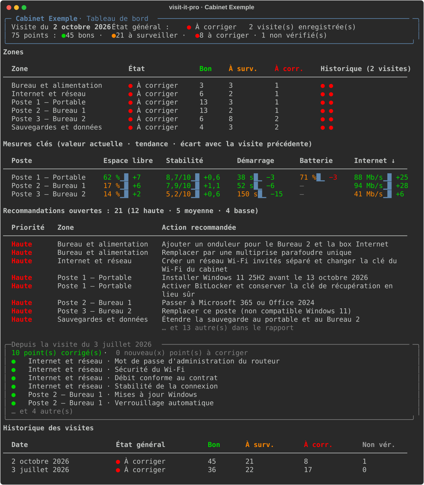
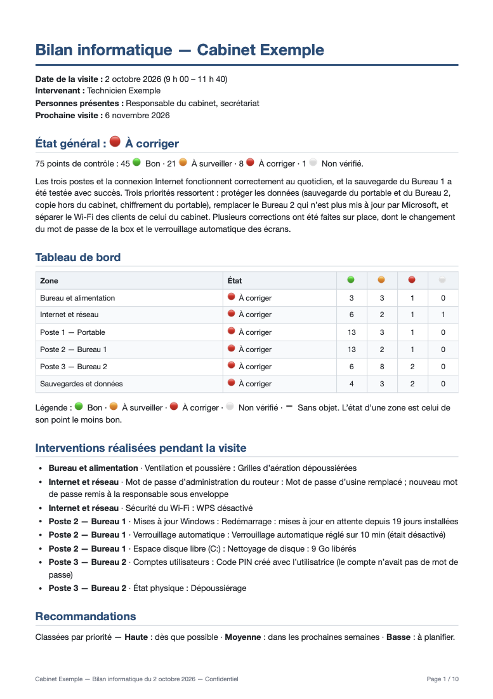

# visit-it-pro

[](https://github.com/AD0791/visit_IT_pro/actions/workflows/ci.yml)

[](https://github.com/AD0791/visit_IT_pro/blob/main/LICENSE)

**Checklist-driven IT site visits, from the command line.** You fill a Markdown checklist while you
walk through a client's office. One command then turns it into a clean PDF report for the owner,
saves the visit in a SQLite database, and draws a terminal dashboard that shows how the office is
doing from one visit to the next. That dashboard can also go into the report.

It is made for independent technicians and small IT providers who look after small offices
(notaries, doctors, accountants, shops) with a handful of Windows computers and one internet line,
and who need to *prove* that everything is reliable, not just fix things.

> **Language:** the command line and this guide are in English. The checklists, reports and
> dashboard are in **French** (the first client is a French-speaking notary office). The templates
> can be customised; see [Customising](#customising).



<p align="center">
  
</p>

Sample outputs from the fictional demo office:
[PDF report](https://github.com/AD0791/visit_IT_pro/blob/main/examples/demo/visits/2026-10-02/rapport-2026-10-02.pdf) ·
[Markdown report](https://github.com/AD0791/visit_IT_pro/blob/main/examples/demo/visits/2026-10-02/rapport-2026-10-02.md) ·
[filled checklist](https://github.com/AD0791/visit_IT_pro/blob/main/examples/demo/visits/2026-10-02/checklist.md)

---

## Contents

1. [How it works](#how-it-works)
2. [Requirements](#requirements)
3. [Installation](#installation)
4. [Quick start](#quick-start)
5. [Concepts](#concepts)
6. [The workspace and `visit-it-pro.toml`](#the-workspace-and-visit-it-protoml)
7. [A visit, step by step](#a-visit-step-by-step)
8. [The checklist format](#the-checklist-format)
9. [The checkpoints](#the-checkpoints)
10. [Command reference](#command-reference)
11. [The report](#the-report)
12. [The SQLite database](#the-sqlite-database)
13. [The dashboard](#the-dashboard)
14. [Customising](#customising)
15. [Confidentiality](#confidentiality)
16. [Troubleshooting](#troubleshooting)
17. [Development](#development)
18. [Publishing a release](#publishing-a-release)
19. [License](#license)

---

## How it works

```text
            before the visit            on site                  after the visit
visit-it-pro new ──► visits/<date>/checklist.md ──► you fill it ──► visit-it-pro report <date>
                                                                          │
                          ┌───────────────────────────────────────────────┼──────────────────────────┐
                          ▼                                               ▼                          ▼
              visit-it-pro.db (SQLite)                         rapport-<date>.md          rapport-<date>.pdf
                          │                                                                  ▲
                          ▼                                                                  │
              visit-it-pro dashboard ──── tableau-de-bord.svg (snapshot) ────────────────────┘
```

- **One file per visit is both the checklist and your notes.** You change `[ ]` to `[x]`, `[~]` or
  `[!]`, type what you measured after `::`, and add lines for what you fixed and what you recommend.
  Every checkpoint carries a hidden hint telling you how to check it with built-in Windows tools.
- **The report writes itself.** It includes an overall status, a dashboard per zone, the work done on
  site, recommendations sorted by priority, a key-measurements table, and appendices (inventory,
  every checkpoint, photos). The only thing you write is a 4–5 sentence summary.
- **Every visit is kept.** Reports save the visit into a SQLite database in the client's folder, so you
  get history, trends and "fixed since last time" for free.
- **A terminal dashboard** shows zone history, trends with sparklines, open recommendations and
  progress. The same view is inserted into the report as an image.
- **Private stays private.** The interview and notes sections of the checklist never reach the report
  or the database.

## Requirements

| Needed for | What | Install |
|---|---|---|
| Everything | Python 3.11 or newer | [python.org](https://www.python.org/downloads/) or `uv python install` |
| PDF reports | [pandoc](https://pandoc.org) | macOS `brew install pandoc` · Windows `winget install JohnMacFarlane.Pandoc` · Debian/Ubuntu `sudo apt install pandoc` |
| PDF reports | Google Chrome, Chromium or Microsoft Edge | Usually already installed. Otherwise install one, or point `VISIT_IT_PRO_CHROME` at its executable. |
| Photos in PDFs (optional) | macOS `sips` (built in) | Shrinks photos and converts iPhone HEIC to JPEG. Elsewhere, use JPEG or PNG photos. |
| Emoji in PDFs on Linux | A colour emoji font | `sudo apt install fonts-noto-color-emoji` |

Without pandoc or a browser you still get the Markdown report (`--no-pdf`). If pandoc is present but
no browser is found, an `.html` file is written instead: open it and print it to PDF.

## Installation

The recommended way is [uv](https://docs.astral.sh/uv/), which installs the `visit-it-pro` command
in its own isolated environment:

```bash
# From PyPI
uv tool install visit-it-pro

# Latest development version, straight from GitHub
uv tool install git+https://github.com/AD0791/visit_IT_pro

# Alternatives
pipx install visit-it-pro
pip install visit-it-pro
```

From a local clone, in editable mode (changes to the source take effect immediately):

```bash
git clone https://github.com/AD0791/visit_IT_pro.git
uv tool install --editable ./visit_IT_pro
```

Check it works:

```bash
visit-it-pro --version
visit-it-pro --help
```

To upgrade later: `uv tool upgrade visit-it-pro`. To remove it: `uv tool uninstall visit-it-pro`.

## Quick start

### Try it on the demo office (2 minutes)

The repository contains a fictional office with two filled visits (July and October 2026):

```bash
git clone https://github.com/AD0791/visit_IT_pro.git && cd visit_IT_pro
uv run visit-it-pro -w examples/demo report 2026-07-03
uv run visit-it-pro -w examples/demo report 2026-10-02
uv run visit-it-pro -w examples/demo dashboard
open examples/demo/visits/2026-10-02/rapport-2026-10-02.pdf   # macOS; use xdg-open or start elsewhere
```

### Set up a real client

```bash
mkdir -p ~/Clients/Cabinet-Martin && cd ~/Clients/Cabinet-Martin
visit-it-pro init --office "Cabinet Martin" --technician "Your Name"
```

Open `visit-it-pro.toml`, add your phone and email, and list the client's computers (see
[the workspace](#the-workspace-and-visit-it-protoml)). Then, for every visit:

```bash
visit-it-pro new --date 2026-10-02      # before: creates visits/2026-10-02/checklist.md
# … on site: fill visits/2026-10-02/checklist.md, put photos in visits/2026-10-02/photos/ …
visit-it-pro check 2026-10-02           # what is left? any warnings?
visit-it-pro report 2026-10-02          # after: rapport-2026-10-02.md + .pdf, visit saved
visit-it-pro dashboard                  # the history of this client
```

## Concepts

| Term | Meaning |
|---|---|
| **Workspace** | A folder for one client, containing `visit-it-pro.toml`, a `visits/` folder and the `visit-it-pro.db` database. Keep one workspace per client. |
| **Visit** | One on-site evaluation: the folder `visits/<date>/` with its `checklist.md`, `photos/` and generated reports. |
| **Checklist** | The Markdown file you fill in on site. It is the single source of truth: reports and the database are always rebuilt from it. |
| **Zone** | A `##` section of the checklist: office and power, internet and network, one per computer, backups and data. |
| **Checkpoint** | One line to check, with an ID such as `PC1-espace` (free disk space of computer PC1). |
| **Status** | The state of a checkpoint at the end of the visit: 🟢 Bon, 🟠 À surveiller, 🔴 À corriger, ➖ Sans objet, ⚪ Non vérifié. A zone takes the status of its worst checkpoint; the visit takes the status of its worst zone. |
| **Recommendation** | What should be done next, with a priority: haute (as soon as possible), moyenne (within weeks), basse (to plan). |
| **Report** | `rapport-<date>.md` and `rapport-<date>.pdf`, written for the office owner, in plain French. |
| **Dashboard** | The terminal view built from the database, also inserted into the report. |

## The workspace and `visit-it-pro.toml`

A workspace looks like this:

```text
Cabinet-Martin/
├── visit-it-pro.toml          # the office, you, the computers
├── visit-it-pro.db            # SQLite history (created by the first report)
├── templates/                 # optional: your customised templates
└── visits/
    ├── 2026-07-03/
    │   ├── checklist.md
    │   ├── photos/
    │   ├── rapport-2026-07-03.md
    │   ├── rapport-2026-07-03.pdf
    │   └── tableau-de-bord.svg
    └── 2026-10-02/
        └── …
```

Every command finds the workspace by looking for `visit-it-pro.toml` in the current folder and its
parents, like git does. From anywhere else, pass `--workspace PATH` (or `-w PATH`) before the command,
or set the `VISIT_IT_PRO_WORKSPACE` environment variable.

### Reference

```toml
[office]
name = "Cabinet Martin"            # required; printed on every report

[technician]
name = "Your Name"                 # written into each new checklist, printed on reports
phone = "+33 6 00 00 00 00"        # printed in the report's closing line
email = "you@example.com"          # printed in the report's closing line

[report]
dashboard = true                   # insert the dashboard snapshot into every report

[paths]                            # optional; relative to this file
visits = "visits"
database = "visit-it-pro.db"

# One block per computer, in the order they should appear.
[[computers]]
id = "PC1"                         # letters and digits only; prefixes every checkpoint ID (PC1-espace…)
name = "Portable"                  # shown in the checklist and the report: "Poste 1 — Portable"
kind = "laptop"                    # "laptop" adds the battery checkpoint

[[computers]]
id = "PC2"
name = "Accueil"
kind = "desktop"
```

Phone and email are only printed when the checklist's `intervenant:` is the technician named here, so
a colleague's visit never shows your contact details.

When the office buys, replaces or retires a computer, edit the `[[computers]]` list; the next
`visit-it-pro new` uses it. Keep the same `id` for the same machine so its history continues on the
dashboard.

## A visit, step by step

### Before the visit (5 minutes)

1. Ask the owner for what you will need: the administrator password of each computer (or someone on
   site who can type it), the router's login, the internet contract (for the contracted speed), access
   to the backup drive or cloud, and the names of the business software.
2. Agree in writing on the scope, for example that client files are out of bounds.
3. Run `visit-it-pro new --date YYYY-MM-DD` and open the checklist in your editor (VS Code works well:
   the hints are visible in the editor and hidden in the preview).

### On site (about 2 h 30 the first time, less afterwards)

A route that works: interview the owner and staff (15 min, private notes) → walk around the office
(10 min) → router and network (20 min) → each computer (about 25 min each) → backups with the owner,
including a real restore test (20 min) → unplug test of the UPS and a spoken debrief of the top three
points (10 min).

For each checkpoint, read the hint under it, check, and replace `[ ]`:

```markdown
- [x] PC1-espace Espace disque libre (C:) :: 62 %
- [!] PC1-chiffrement Chiffrement du disque :: Désactivé :: portable emporté chaque soir
  - reco haute: Activer BitLocker et conserver la clé de récupération en lieu sûr
- [x] PC2-verrouillage Verrouillage automatique :: 10 min
  - fait: Verrouillage automatique réglé sur 10 min (était désactivé)
```

The status is the state **at the end of the visit**: something you fixed on site is 🟢 with a `fait:`
line, so the report shows both the good news and the work you did. Run `visit-it-pro check <date>`
at any time to see what is left.

### After the visit (20–30 minutes)

1. Write the **Synthèse**: 4–5 plain sentences for the owner (overall state, strengths, the two or
   three priorities, what you did).
2. Run `visit-it-pro report <date>` and fix whatever the warnings point out (a 🔴 without a
   recommendation, unchecked items…). Run it again; it replaces the previous output and the saved
   visit.
3. Proofread the PDF, send it, keep the Markdown copy.

## The checklist format

A checklist is plain Markdown with a few conventions. This is its contract with the parser.

### Front matter

```yaml
---
cabinet: Cabinet Martin           # office name for this visit (defaults to the config)
date: 2026-10-02                  # required, YYYY-MM-DD; also the visit's key in the database
intervenant: Your Name
presents: Responsable du cabinet, secrétariat
arrivee: 9 h 00
depart: 11 h 40
prochaine_visite: 2026-11-06
---
```

English keys are accepted too: `office`, `technician`, `attendees`, `arrival`, `departure`, `next_visit`.

### Sections

| Section | Role |
|---|---|
| `## Synthèse` (or `## Summary`) | Your summary for the owner, copied **as is** into the report. |
| `## Entretien` (or `## Interview`) | **Private.** Interview prompts and answers. Never in the report or the database. |
| `## Notes` | **Private.** Anything for yourself. Never in the report or the database. |
| Any other `## Title (CODE)` | A scored **zone**. The `(CODE)` is stripped from the title and used to follow the zone across visits. |
| `### Fiche` inside a zone | Inventory lines, `- Key (hint) : value`. Filled values go to the report's inventory appendix; the `(hint)` is dropped. |
| `### Contrôles` inside a zone | The checkpoints. |

### Checkpoint lines

```text
- [c] ID Libellé :: valeur :: note
```

| Code `c` | Status | Meaning |
|:---:|---|---|
| `x` | 🟢 Bon | OK at the end of the visit |
| `~` | 🟠 À surveiller | Works, but needs watching or a planned action |
| `!` | 🔴 À corriger | A real problem: needs a recommendation |
| `-` | ➖ Sans objet | Does not apply here |
| space | ⚪ Non vérifié | Not checked yet |

- **valeur** (optional): what you measured, for example `62 %`, `8,7/10`, `38 s`, `↓88 ↑45 Mb/s · 12 ms · Wi-Fi 81 %`.
  The **first number** in it (with a comma or a dot) is stored as a number and drives the trends.
- **note** (optional): context, for example `portable emporté chaque soir`.
- The ID must be unique. The part after the first `-` (the *suffix*) identifies the kind of check across computers.

### Lines under a checkpoint (indented)

| Line | Goes to |
|---|---|
| `- fait: …` (or `done:`) | "Interventions réalisées pendant la visite" |
| `- reco haute: …` / `reco moyenne:` / `reco basse:` (or `high` / `medium` / `low`) | The recommendations table, sorted by priority. `reco:` alone means moyenne. |
| `- photo: photos/NAME.jpg` | Appendix C (photos), captioned with the zone and checkpoint |
| any other `- …` | Appended to the checkpoint's note |

HTML comments (`<!-- … -->`) are how-to-check hints: they stay in your file and are ignored everywhere else.

### Warnings

`check` and `report` warn about: a 🔴 without a `reco`, checkpoints still unchecked, an unknown status
code or priority, a duplicate ID, a missing photo file, an empty Synthèse, and any line the parser did
not understand (a typo such as `-[x]` without a space would otherwise silently drop a checkpoint).

## The checkpoints

The built-in checklist has **26 office checkpoints plus 16 per desktop and 17 per laptop** (75 for an
office with one laptop and two desktops). Each has a hint with thresholds and where to look in
Windows.

<details>
<summary><strong>Show every checkpoint</strong></summary>

#### Bureau et alimentation (BUR): office and power

| ID | Checkpoint | 🟢 when |
|---|---|---|
| `BUR-onduleur` | Onduleurs | Desktops and the router on a UPS lasting ≥ 5 min (unplug test) |
| `BUR-surtension` | Protection contre les surtensions | Surge-protected strips, none plugged into another |
| `BUR-ventilation` | Ventilation et poussière | Towers not boxed in, not on a dusty floor; vents clean |
| `BUR-cablage` | Câblage | Tidy, no strain, nothing to trip over |
| `BUR-confidentialite` | Confidentialité aux postes | Screens not visible to visitors; no passwords on sticky notes |
| `BUR-portable` | Sécurité physique du portable | Locked away or cable-locked out of hours |
| `BUR-impression` | Imprimante et scanner | Test page and test scan work from each computer that needs them |

#### Internet et réseau (NET)

| ID | Checkpoint | 🟢 when |
|---|---|---|
| `NET-box` | Box / routeur | Ventilated, on a UPS, lights normal |
| `NET-admin` | Mot de passe d'administration | Not the default one; kept somewhere safe by the office |
| `NET-firmware` | Micrologiciel | Up to date or auto-update on |
| `NET-wifi` | Sécurité du Wi-Fi | WPA2/WPA3, strong key, WPS off |
| `NET-invites` | Wi-Fi invités | Clients use a separate guest network (or none) |
| `NET-appareils` | Appareils connectés | Every device in the router's list is identified |
| `NET-debit` | Débit conforme au contrat | Best computer ≥ 70 % of the contracted speed |
| `NET-stabilite` | Stabilité | `ping -n 100 8.8.8.8`: 0 % loss (1–2 % 🟠, > 2 % 🔴) |
| `NET-coupures` | Coupures signalées | None or rare in the last month |
| `NET-secours` | Solution de secours | Phone hotspot tested (or a second provider) |

#### Poste N (per computer; `PC1-…`, `PC2-…`)

| Suffix | Checkpoint | 🟢 when |
|---|---|---|
| `windows` | Version de Windows | A supported Windows 11 release (dates are in the hint) |
| `maj` | Mises à jour Windows | Nothing pending or failed; last install < 30 days |
| `antivirus` | Antivirus | Real-time protection on, definitions < 3 days, a single antivirus |
| `parefeu` | Pare-feu | On for all three profiles |
| `chiffrement` | Chiffrement du disque | BitLocker / device encryption on, recovery key stored safely |
| `comptes` | Comptes utilisateurs | One protected account per person; daily account not admin |
| `verrouillage` | Verrouillage automatique | Screen locks after ≤ 10 min |
| `espace` | Espace disque libre (C:) | ≥ 20 % free (10–20 % 🟠, < 10 % 🔴) |
| `disque` | Santé du disque | Healthy; system disk is an SSD |
| `stabilite` | Stabilité (indice /10) | Reliability Monitor index ≥ 7 |
| `demarrage` | Temps de démarrage | Usable desktop in < 90 s |
| `logiciels` | Logiciels à jour et licenciés | Supported Office, PDF reader and browser; no pirated software |
| `distance` | Accès à distance | No remote-access tool, or a known and justified one |
| `usages` | Test des usages quotidiens | Business software, print, scan, email and web all work |
| `internet` | Internet depuis ce poste | Speed test and Wi-Fi signal (≥ 70 %) |
| `etat` | État physique | Clean vents, quiet fans, screen/keyboard/ports fine |
| `batterie` | Batterie (laptops only) | Full-charge vs design capacity ≥ 80 % |

#### Sauvegardes et données (SAV): backups and data

| ID | Checkpoint | 🟢 when |
|---|---|---|
| `SAV-cartographie` | Emplacement des données connu | We know where client files and business data live |
| `SAV-existe` | Sauvegarde en place | Every computer with important data is backed up |
| `SAV-auto` | Sauvegarde automatique | Runs without anyone having to remember |
| `SAV-recente` | Dernière sauvegarde réussie | ≤ 7 days ago |
| `SAV-horssite` | Copie hors du cabinet | One copy outside the office |
| `SAV-rancongiciel` | Copie protégée des rançongiciels | One copy disconnected or versioned |
| `SAV-restauration` | Test de restauration | A real file restored and opened: the proof backups work |
| `SAV-logiciel` | Données du logiciel métier | The business software's data is in the backup |
| `SAV-comptes` | Comptes en ligne protégés | 2FA on, recovery details current, no shared passwords |

</details>

## Command reference

Global options go **before** the command:

| Option | Meaning |
|---|---|
| `-w, --workspace PATH` | The client folder (default: current folder or a parent). Also `VISIT_IT_PRO_WORKSPACE`. |
| `--version` | Print the version. |
| `--help` | Help for the tool, or for a command (`visit-it-pro report --help`). |

A `VISIT` argument is either a date (`2026-10-02`, meaning `visits/2026-10-02/`) or a path to a visit folder.

### `init [PATH]`

Turns `PATH` (default: the current folder) into a workspace: writes `visit-it-pro.toml` and creates `visits/`.

| Option | Default | Meaning |
|---|---|---|
| `--office TEXT` | `Mon client` | Office name |
| `--technician TEXT` | empty | Your name |
| `--force` | off | Overwrite an existing `visit-it-pro.toml` |

### `new`

Creates `visits/<date>/checklist.md` and `visits/<date>/photos/` from the templates and the computer list.
Refuses to overwrite an existing checklist.

| Option | Default | Meaning |
|---|---|---|
| `--date YYYY-MM-DD` | today | Visit date |
| `--force` | off | Overwrite an existing checklist (you lose what was in it) |

### `check VISIT`

Shows, per zone, how many checkpoints are done and their statuses, then the warnings. Writes nothing.
Handy on site to see what is left.

### `report VISIT`

Parses and checks the checklist, saves the visit in the database, exports the dashboard snapshot, and
writes `rapport-<date>.md` and `rapport-<date>.pdf` in the visit folder. Running it again replaces all
of them, including the saved visit. It exits with code 1 if the PDF was requested but could not be built;
the Markdown report is still written.

| Option | Default | Meaning |
|---|---|---|
| `--pdf / --no-pdf` | `--pdf` | Build the PDF (needs pandoc and a browser) |
| `--save / --no-save` | `--save` | Save the visit into the database |
| `--dashboard / --no-dashboard` | `[report] dashboard` | Insert the dashboard snapshot. Needs `--save`, because the dashboard is read from the database. |

### `save VISIT`

Saves a visit into the database without building its report, for example to import visits done before
you used the database. Saving the same date again replaces the previous version.

### `list`

Lists the saved visits: date, overall status, counts per status, number of recommendations, technician.

### `dashboard`

Prints the dashboard in the terminal.

| Option | Default | Meaning |
|---|---|---|
| `--date YYYY-MM-DD` | latest | The dashboard as it was at that visit (later visits ignored) |
| `--export FILE` | none | Also save it: `.svg` (terminal snapshot) or `.html` |
| `--width N` | 100 | Width in characters of the exported file |

### `templates`

Copies the built-in templates into `<workspace>/templates/` so you can edit them (see
[Customising](#customising)). Existing files are kept unless you add `--force`.

## The report

`rapport-<date>.pdf` (A4, page numbers, "Confidentiel" footer) and the same content as
`rapport-<date>.md`:

1. **Header**: office, date and times of the visit, technician, people present, next visit.
2. **État général**: the overall status, the counts, and your Synthèse.
3. **Tableau de bord**: every zone with its status and counts.
4. **Interventions réalisées pendant la visite**: every `fait:` line.
5. **Recommandations**: priority, zone, what was found, the recommended action; high priority first.
6. **Mesures clés**: per computer, free space, disk, stability, boot time, internet and battery, plus
   the contracted and measured internet speed.
7. **Suivi dans le temps**: the dashboard snapshot, on its own page (when enabled).
8. **Annexe A**: inventory (the filled `Fiche` lines). **Annexe B**: every checkpoint with its status and
   observation. **Annexe C**: photos.

The PDF is made by converting the Markdown to HTML with pandoc, then printing it with a headless
Chromium-based browser. Photos are embedded; on macOS they are first shrunk to 1600 px and converted
to JPEG with `sips`, so iPhone HEIC photos work.

## The SQLite database

`visit-it-pro.db` sits in the workspace (path configurable). It is written by `report` and `save`;
saving a date again replaces that visit completely, so the database always matches the checklists.
The private sections are never stored.

| Table | One row per | Main columns |
|---|---|---|
| `visits` | visit | `date` (unique), `office`, `technician`, `summary`, `overall`, `n_ok`, `n_watch`, `n_fix`, `n_todo`, `n_na`, `saved_at` |
| `zones` | zone of a visit | `visit_id`, `position`, `code` (BUR, NET, PC1…), `title`, `status`, `is_computer` |
| `items` | checkpoint | `visit_id`, `zone_id`, `check_id` (PC1-espace…), `label`, `status`, `value`, `value_num`, `note` |
| `actions` | `fait:` line | `item_id`, `text` |
| `recommendations` | `reco` line | `item_id`, `priority` (haute, moyenne, basse), `text` |
| `photos` | photo | `item_id`, `path` |
| `inventory` | filled Fiche line | `zone_id`, `key`, `value` |

Statuses are stored as `ok`, `watch`, `fix`, `todo` and `na`. Deleting a visit removes its rows in every
table (foreign keys with `ON DELETE CASCADE`). The schema version is kept in `PRAGMA user_version`.

A few queries you can run with `sqlite3 visit-it-pro.db`:

```sql
-- Free disk space of every computer, visit after visit
SELECT v.date, i.check_id, i.value_num
FROM items i JOIN visits v ON v.id = i.visit_id
WHERE i.check_id LIKE '%-espace' ORDER BY i.check_id, v.date;

-- High-priority recommendations of the latest visit
SELECT z.title, i.label, r.text
FROM recommendations r JOIN items i ON i.id = r.item_id JOIN zones z ON z.id = i.zone_id
WHERE i.visit_id = (SELECT id FROM visits ORDER BY date DESC LIMIT 1) AND r.priority = 'haute';

-- Checkpoints that were 🔴 at every saved visit
SELECT check_id, label FROM items GROUP BY check_id
HAVING SUM(status = 'fix') = (SELECT COUNT(*) FROM visits);
```

## The dashboard

`visit-it-pro dashboard` reads the database and shows, as of the latest visit (or `--date`):

- **Header**: office, visit date, overall status, number of saved visits, counts.
- **Zones**: each zone's status and counts, with a coloured dot per recent visit (up to six).
- **Mesures clés**: per computer, the current free space, stability index, boot time, battery and
  download speed, with a sparkline over the saved visits and the change since the previous visit,
  green when it improved and red when it got worse (a shorter boot time is an improvement).
- **Recommandations ouvertes**: counts per priority and the most urgent ones.
- **Depuis la visite du …**: how many checkpoints went from 🟠/🔴 to 🟢, how many new 🔴 appeared, and which.
- **Historique des visites**: status and counts of the recent visits.

It needs at least one saved visit; trends and progress appear from the second one. By default every
report embeds it as `tableau-de-bord.svg` in a "Suivi dans le temps" section; turn that off with
`[report] dashboard = false` or `--no-dashboard`. Export it yourself with
`visit-it-pro dashboard --export board.svg` (or `.html`).

## Customising

Run `visit-it-pro templates` to copy the three built-in templates into `<workspace>/templates/`.
Files there take precedence over the built-in ones, so each client can have its own checklist.

| Template | Used by | Placeholders and markers |
|---|---|---|
| `checklist-site.md` | `new` | `{OFFICE}`, `{DATE}`, `{TECHNICIAN}`, and `{COMPUTERS}` on its own line, replaced by one block per computer |
| `checklist-computer.md` | `new`, once per computer | `{N}` (1, 2, 3…), `{ID}` (PC1…), `{NAME}`; lines between `<!-- if laptop -->` and `<!-- endif -->` are kept only for laptops (`<!-- if desktop -->` works too) |
| `report.css` | `report` | Print stylesheet; `__PIED__` is replaced by the footer text |

Guidelines:

- **Adding a checkpoint:** add a line `- [ ] ID Libellé ::` with a new, unique ID (for computers,
  `{ID}-suffix`) and, if you like, a hint comment under it. Existing reports and the database need no change.
- **Keep these suffixes** if you want the key-measurements table and the dashboard trends:
  `espace`, `disque`, `stabilite`, `demarrage`, `internet`, `batterie`; and `windows`, which marks a
  zone as a computer. On the network zone, `NET-debit` and `NET-stabilite` feed the internet line of
  the report, and a Fiche line starting with "Débit contractuel" gives the contracted speed.
- **Renaming a checkpoint's label** is safe; **changing its ID** starts a new history for it.
- Checkpoints edited in a template only affect checklists created afterwards.

## Confidentiality

A client's workspace holds sensitive information: the office's equipment, weaknesses and, in the
interview, remarks about people. Some rules the tool helps with, and some it can't enforce:

- The `Entretien` and `Notes` sections never leave the checklist: not in the report, not in the database.
- Never write passwords, recovery keys or client names in a checklist. Write "known by X, stored in Y".
- Photos must not show documents or screens with client data.
- Keep workspaces **out of public repositories** and shared cloud folders. This repository's
  `.gitignore` refuses `*.db`, `/visits/` and `/visit-it-pro.toml`, so running `init` inside the
  clone by mistake does not leak anything.

## Troubleshooting

| Symptom | Fix |
|---|---|
| `No visit-it-pro.toml found …` | Run the command inside the client folder, pass `-w PATH`, or run `visit-it-pro init` first. |
| `pandoc not found` | Install pandoc (see [Requirements](#requirements)) or use `--no-pdf`. |
| An `.html` file instead of the PDF | No browser was found. Install Chrome/Chromium/Edge or set `VISIT_IT_PRO_CHROME=/path/to/chrome`, or print the HTML to PDF yourself. |
| `the browser did not produce the PDF` | The message shows the end of the browser's log. Try another browser via `VISIT_IT_PRO_CHROME`. |
| Emoji show as boxes in the PDF (Linux) | Install a colour emoji font (`fonts-noto-color-emoji`). |
| A photo is missing from the PDF | Check the `photo not found` warning and the path, relative to the visit folder. Outside macOS, convert HEIC photos to JPEG. |
| `line N: not understood` | A typo in a checkpoint line, for example `-[x]` or a missing space. Fix it, or the line is left out. |
| A checkpoint is missing from the trends | Its value has no number, or its ID suffix is not one of those listed in [Customising](#customising). |
| `…was written by a newer visit-it-pro` | Upgrade the package: `uv tool upgrade visit-it-pro`. |

About the browser: some Chrome versions write the PDF but never exit in headless mode. visit-it-pro
watches the browser's log for "written to file", then stops the browser and all its helper
processes, so a report never hangs.

## Development

```bash
git clone https://github.com/AD0791/visit_IT_pro.git && cd visit_IT_pro
uv sync                         # creates .venv with the package (editable) and dev tools
uv run pytest                   # tests; the PDF test is skipped without pandoc and a browser
uv run ruff check               # lint
uv run ruff format              # format
uv run visit-it-pro --help      # run the CLI from the source tree
```

Project layout:

```text
src/visit_it_pro/
├── cli.py          # Typer commands
├── config.py       # workspace discovery and visit-it-pro.toml
├── checklist.py    # building a blank checklist from the templates
├── parser.py       # checklist → Visit, warnings
├── model.py        # statuses, Item / Zone / Visit
├── report.py       # Visit → Markdown report
├── pdf.py          # Markdown → HTML (pandoc) → PDF (headless browser)
├── store.py        # SQLite schema, saving and queries
├── dashboard.py    # Rich dashboard and its SVG/HTML export
└── templates/      # checklist-site.md, checklist-computer.md, report.css
examples/
├── demo/           # fictional workspace used by the tests and this README
└── make_demo.py    # regenerates the demo checklists after a template change
tests/              # pytest suite
```

After changing a template, run `uv run python examples/make_demo.py`, rebuild the demo reports and
re-run the tests. The README images come from the demo:

```bash
uv run visit-it-pro -w examples/demo report 2026-07-03
uv run visit-it-pro -w examples/demo report 2026-10-02
uv run visit-it-pro -w examples/demo dashboard --export docs/dashboard.svg
sips -s format png -Z 1100 examples/demo/visits/2026-10-02/rapport-2026-10-02.pdf --out docs/report-first-page.png
```

## Publishing a release

Releases go to PyPI through GitHub Actions with
[trusted publishing](https://docs.pypi.org/trusted-publishers/): no password or token is stored anywhere.

One-time setup (already done for this repository, kept for reference and forks):

1. Create an account on [pypi.org](https://pypi.org) and enable two-factor authentication.
2. In your PyPI account, open **Publishing** and add a *pending publisher*: PyPI project name
   `visit-it-pro`, owner `AD0791`, repository `visit_IT_pro`, workflow `publish.yml`, environment `pypi`.
3. In the GitHub repository, **Settings → Environments → New environment** named `pypi`. Under
   **Deployment branches and tags**, allow only tags matching `v*`. You can also require your
   approval before each release.

For each release:

1. Update `version` in `pyproject.toml` and add a section to `CHANGELOG.md`.
2. Commit and push `main`, wait for CI to pass, then tag and push the tag:
   `git tag v0.2.0 && git push origin v0.2.0`.
3. The **Publish to PyPI** workflow:
   - runs the linters and the tests;
   - stops if the tag doesn't match `version` in `pyproject.toml` (a PyPI version can never be
     re-uploaded, so a mismatched tag must not publish anything);
   - points the README images at the tag's files on GitHub, because PyPI can't resolve the relative
     `docs/` paths;
   - builds the wheel and sdist and checks that the built command starts;
   - uploads them from a separate job, the only one allowed to request a PyPI token.

To publish by hand instead: `uv build`, then `uv publish --token <your PyPI token>` (the README images
will be missing on PyPI unless you apply the workflow's `sed` rewrite first). You can rehearse on
[TestPyPI](https://test.pypi.org) with `uv publish --publish-url https://test.pypi.org/legacy/ --token …`.

## License

[MIT](https://github.com/AD0791/visit_IT_pro/blob/main/LICENSE) © 2026 Alexandro Disla
